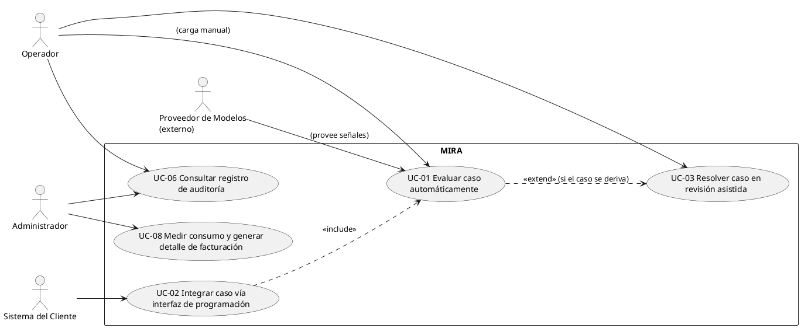
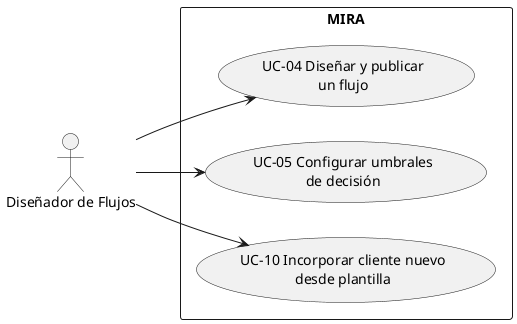
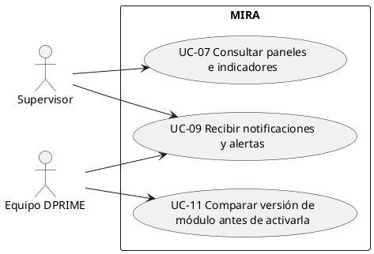

# Fase 4 — Casos de uso (§5.3.2)

**Insumos usados:** inventario de `estructura-texto/*.json` (Fase 1), hallazgos de `fase2/consolidacion-contradicciones.json` (Fase 2), y el modelo de dominio/glosario ya existente en `informe proyecto/Informe Mira - LLM.docx` §3.1 (actores y nombres de entidad tomados de ahí, sin inventar roles nuevos).

---

## Texto para el informe (versión condensada, lista para pegar en §5.3.2)

> Esta sección es la versión resumida para el documento final. El detalle completo (citas extendidas por frase, preguntas pendientes desarrolladas) queda más abajo en este mismo archivo como respaldo/anexo — no debe copiarse tal cual: la sección Análisis de requisitos completa (7 artefactos) tiene un máximo de 8 planas, y esta es solo una de sus siete partes.

### 5.3.2 Casos de uso

Se presentan tres diagramas de casos de uso (PlantUML), agrupados por rol para mantener la legibilidad. Entre los tres cubren los 11 casos de uso identificados, sin repeticiones.

**Figura 1 — Operador y Administrador** (incluye Sistema del Cliente y Proveedor de Modelos, externo, por su relación directa con UC-01/UC-02): UC-01 Evaluar caso automáticamente, UC-02 Integrar caso vía interfaz de programación, UC-03 Resolver caso en revisión asistida, UC-06 Consultar registro de auditoría, UC-08 Medir consumo y generar detalle de facturación.

**Figura 2 — Diseñador de Flujos:** UC-04 Diseñar y publicar un flujo, UC-05 Configurar umbrales de decisión, UC-10 Incorporar cliente nuevo desde plantilla.

**Figura 3 — Supervisor y Equipo DPRIME:** UC-07 Consultar paneles e indicadores, UC-09 Recibir notificaciones y alertas, UC-11 Comparar versión de módulo antes de activarla.

*(Imágenes ya renderizadas en `fase4/diagramasCU/diagrama1CU.png`, `diagrama2CU.png`, `diagrama3CU.png`.)*

**Selección de los 3 casos de uso críticos.** Criterio: riesgo de que una especificación equivocada obligue a rehacer trabajo.

| Caso de uso | Riesgo |
|---|---|
| UC-01 Evaluar caso automáticamente | El umbral bajo 60 puntos queda sin resolver (H-01); especificarlo mal obliga a rehacer el motor de decisión completo. |
| UC-02 Integrar caso vía interfaz de programación | La arquitectura síncrona vs. asíncrona era el riesgo al momento de elegir este UC (H-13, ya resuelto: rige Flujo B para el cliente piloto); es el contrato con el sistema del cliente, no un detalle interno. |
| UC-03 Resolver caso en revisión asistida | El orden de despliegue del puntaje frente a la evidencia queda sin resolver (H-12); cambia el layout de la pantalla que decide si la plataforma se usa o no. |

---

**UC-01 — Evaluar caso automáticamente**
Actor principal: Cliente, vía interfaz de programación, carga manual de un operador o carpeta compartida (§2.4). Actor secundario: Proveedor de modelos externo.
Precondiciones: flujo publicado con al menos un módulo de análisis activo; umbrales de decisión configurados para el tipo de proceso (§3).
Flujo principal: (1) llega evidencia de un caso nuevo o existente (§2.4); (2) se asigna/reutiliza un identificador único y permanente (§3); (3) se verifica que la evidencia sea legible (§2.4); (4) se ejecutan los módulos de análisis activos, generando una señal por módulo (§2.5, §2.9); (5) se cruzan las señales y se calcula un puntaje de confianza 0-100 con su desglose (§2.5-§2.6); (6) se aplican los umbrales del cliente para traducir el puntaje en una decisión (§2.6); (7) si el puntaje supera el umbral de aprobación automática y ninguna señal está bajo su mínimo, se aprueba automáticamente (§2.6); (8) se registra en auditoría evidencia, módulos, señales, puntaje y decisión (§2.11); (9) el caso queda resuelto y no se vuelve a revisar (§3).
Alternativos: (4a) falla un módulo → se deriva a revisión asistida, UC-03, nunca se aprueba con información parcial (§3); (6a) puntaje en rango de derivación → se deriva a UC-03 (§2.6); (6b) señal de fraude activa → se deriva o escala sin importar el puntaje (§3); (6c) evidencia nueva sobre caso cerrado → se abre un caso nuevo vinculado al anterior (§3).
Excepción: (3a) evidencia no legible → se informa el motivo en lenguaje no técnico (§2.4); (4a-exc) proveedor externo no responde → el caso queda en cola, nunca se descarta (§3, §2.17).
Postcondiciones: caso resuelto o en cola, nunca sin resolución (§3); registro de auditoría inalterable asociado (§2.11); los casos del mismo asegurado o prestador dentro de una ventana breve quedan habilitados para relacionarse (§3).

**UC-02 — Integrar caso vía interfaz de programación**
Actor principal: Sistema del Cliente, operado por su equipo de tecnología (§2.3). Actor secundario: Sistema de siniestros del cliente. Incluye: UC-01.
Precondiciones: el cliente tiene un flujo con un punto de acceso autenticado y con límite de llamadas, generado automáticamente (§2.10).
*Resuelto (H-13, informe §5.1): la plataforma soporta ambos patrones de integración, según el cliente. Para el cliente piloto (su sistema central no expone servicios web, ENT7) rige el Flujo B; Flujo A queda como el patrón general para clientes que sí exponen servicios web.*
Flujo principal A — vía interfaz de programación, síncrona (§2.10): (1) el sistema del cliente invoca el punto de acceso enviando la evidencia en la misma llamada; (2) se valida autenticación y límite de llamadas; (3) se acepta el caso y se responde de inmediato confirmando recepción (ENT3); (4) se ejecuta UC-01; (5) al tener resultado, se notifica al cliente con identificador, puntaje, decisión, desglose y enlace a auditoría.
Flujo principal B — vía archivo compartido, asíncrona (ENT7) — **rige para el cliente piloto**: (1) el sistema del cliente deposita la evidencia en una carpeta compartida que la plataforma revisa periódicamente, porque su sistema central no expone servicios web; (2) se ejecuta UC-01; (3) se entrega el resultado al sistema de siniestros del cliente por archivo, de forma automática, porque ese sistema solo recibe información por esa vía.
Alternativos: (B3a) **resuelto (H-07, informe §5.1) — se descarta.** La escritura del resultado es siempre automática, no por transcripción manual de un operador.
Excepción: (A2a) se supera el límite de llamadas → **mecanismo resuelto (H-03, informe §5.1): rechazo con cabecera Retry-After para tráfico estándar; modo de carga por lote (bulk) con límite propio para cargas masivas predecibles (histórico inicial, catch-up).** Sigue sin definirse el valor numérico exacto de ambos límites, y si este mecanismo (pensado para llamadas a una API) aplica igual al canal de archivos del Flujo B, que no tiene respuesta síncrona — ver preguntas pendientes. (A3a) plataforma no disponible → las llamadas quedan encoladas y se procesan después, sin pérdida (ENT7, §2.17).
Postcondiciones: caso registrado con identificador único, trazable en auditoría; resultado disponible para el sistema del cliente por el canal acordado.

**UC-03 — Resolver caso en revisión asistida**
Actor principal: Operador. Actores secundarios: Supervisor (alerta por demora), Equipo de modelos DPRIME (revisa discrepancias).
Precondiciones: el caso fue derivado a la bandeja de trabajo del operador (§2.7).
Flujo principal: (1) el operador abre un caso de su bandeja (§2.7); (2) se muestra en una sola pantalla la evidencia, el puntaje, su desglose y el motivo de derivación (§2.7); (3) el operador abre cada evidencia y ve qué encontró la plataforma y dónde (§2.7, ENT5); (4) el operador resuelve: aprueba, rechaza o solicita antecedentes adicionales (§2.7); (5) se registra la decisión y su motivo (§2.7); (6) el caso queda resuelto (§3).
*Sobre el paso 2: el orden de despliegue del puntaje frente a la evidencia queda sin resolver (H-12) — §2.7 exige mostrarlo junto a la evidencia, mientras que ENT5 [00:15:16] reporta preferencia por ocultarlo hasta el final para evitar sesgo de anclaje. Ambas fuentes son válidas y se contradicen; queda pendiente de decisión del equipo, a registrar en bitácora.*
Alternativos: (3a) dato mal leído → el operador lo corrige; la corrección queda registrada junto al valor original, sin sobrescribirlo (§3, ENT5); (4a) la decisión del operador difiere de la sugerencia automática → se marca la discrepancia para revisión del equipo de modelos, y prevalece la decisión del operador (§2.7, §3).
Excepción: (1a) el caso se acerca al plazo comprometido sin resolverse → se muestra el tiempo restante y se genera una alerta (§2.7, ENT4).
Postcondiciones: caso resuelto con decisión, motivo y (si corresponde) discrepancia marcada, todo en auditoría (§2.11).

*Las preguntas abiertas H-01, H-10, H-11 y H-12 no se repiten aquí: van en la sección 5.5 (Inconsistencias detectadas y su resolución), con su cita y su resolución/decisión.*

---

## Diagramas de casos de uso (PlantUML)

Incluyen el set completo de casos de uso identificados en el inventario, separados en tres diagramas por grupo de actores para facilitar la lectura por rol. Solo 3 casos de uso se especifican en formato extendido más abajo (criterio de selección: riesgo).

### Diagrama 1 — Operador y Administrador

Incluye también Sistema del Cliente y Proveedor de Modelos (externo), ya que ambos participan de UC-01/UC-02, que viven en este mismo diagrama.

### Diagrama 2 — Diseñador de Flujos

### Diagrama 3 — Supervisor y Equipo DPRIME

**Fuente de cada caso de uso:** UC-01 §2.1/§2.5/§2.6, UC-02 §2.10, UC-03 §2.7, UC-04 §2.8/§2.9/§3, UC-05 §2.6/§2.13/§3, UC-06 §2.11, UC-07 §2.12, UC-08 §2.14, UC-09 §2.15, UC-10 §2.16, UC-11 §2.18.

---

## Casos de uso no críticos — descripción breve

No van en formato extendido (el enunciado solo lo exige para los 3 más críticos, §5.3.2), pero se describen aquí con más detalle que la sola etiqueta del diagrama, citando su fuente.

**UC-04 — Diseñar y publicar un flujo**
Actor principal: Diseñador de Flujos.
El diseñador arma un proceso completo de ingesta, análisis, reglas y decisión sin depender de un desarrollador (§2.3: "debe poder armar y modificar la secuencia de validaciones sin depender de un desarrollador"), combinando módulos activos y conectores externos como bloques (§2.9: "conectores que se comporten como un bloque más dentro del flujo"). Un flujo publicado no puede modificarse en producción: cualquier cambio exige crear, probar y publicar una versión nueva (§3: "Un flujo publicado no puede modificarse en producción: se crea una versión nueva, se prueba y se publica"), y no puede publicarse sin al menos un módulo de análisis activo (§3: "Un flujo sin al menos un módulo de análisis activo no puede publicarse"). Los casos en curso terminan de procesarse con la versión con la que empezaron (§3).

**UC-05 — Configurar umbrales de decisión**
Actor principal: Diseñador de Flujos.
El cliente ajusta, por tipo de proceso, los rangos de puntaje que traducen el resultado del motor en una decisión (§2.6: "Estos rangos deben poder ajustarse por cliente y por tipo de proceso desde el propio diseñador de flujos"; §3: "Los umbrales de decisión los define el cliente"). Todo cambio queda registrado con autor, fecha y valor anterior (§3: "Cualquier cambio de umbral queda registrado con su autor, su fecha y el valor anterior"). *Nota no resuelta:* Daniela (ENT6) pide que mover un umbral crítico exija dos aprobaciones y quede registrado como cambio de política — el cuerpo del documento no lo exige; queda como vacío a decidir, no como regla ya vigente.

**UC-06 — Consultar registro de auditoría**
Actor principal: Operador / Administrador.
Un usuario autorizado consulta desde la interfaz, o descarga, el rastro completo e inalterable de todo lo ocurrido sobre un caso (§2.11: "Ese rastro debe poder consultarse desde la interfaz y descargarse"; "Ningún usuario, incluido el administrador... puede modificarlo ni eliminarlo"). El sistema debe poder reconstruir una decisión pasada tal como se tomó, con las versiones de módulos vigentes en ese momento (§2.11). Solo usuarios de la organización dueña del caso ven su evidencia; el personal de DPRIME requiere autorización expresa y registrada (§3).

**UC-07 — Consultar paneles e indicadores**
Actor principal: Supervisor; secundario: Equipo DPRIME.
La plataforma entrega a cada cliente una visión de su propia operación, y a DPRIME una vista agregada de todos los clientes (§2.12: "La plataforma debe entregar, a cada cliente, una visión de su propia operación"; "Internamente, DPRIME necesita ver lo mismo agregado por todos los clientes"). El indicador de casos donde el operador contradice a la plataforma debe estar visible siempre, aunque sea "el más incómodo para el cliente" (§2.12).

**UC-08 — Medir consumo y generar detalle de facturación**
Actor principal: Administrador (DPRIME); secundario: Cliente.
El sistema cuenta las validaciones de cada cliente en tiempo real y genera, al cierre del período, el detalle que administración necesita para facturar (§2.14: "La plataforma debe llevar el conteo de las validaciones de cada cliente, mostrarlo en tiempo real"; "generar al cierre del período el detalle que administración necesita para emitir la factura"). Una validación se contabiliza cuando el sistema entrega un resultado con puntaje; los reintentos por error interno no se cuentan (§3). *Advertencia:* este caso de uso hereda directamente la ambigüedad de H-02/H-03/H-04 (sin resolver) sobre qué cuenta exactamente como "validación" facturable — no se resolvió aquí tampoco.

**UC-09 — Recibir notificaciones y alertas**
Actor principal: Operador / Supervisor / Equipo DPRIME.
El sistema avisa a cada rol lo que le corresponde sin volverse fuente de ruido (§2.15: "sin convertirse en una fuente de ruido"): al operador, casos nuevos y por vencer; al supervisor, crecimientos inusuales de la bandeja o patrones de fraude reiterados; a DPRIME, errores de procesamiento y caídas de servicios externos (§2.15). Los canales oficiales hacia el cliente son correo electrónico e interfaz (§2.15).

**UC-10 — Incorporar cliente nuevo desde plantilla**
Actor principal: Diseñador de Flujos (del cliente nuevo).
El cliente nuevo adapta una plantilla preconfigurada por caso de uso (con módulos, reglas y umbrales sugeridos ya incluidos) en vez de construir un flujo desde cero, con la meta de procesar casos de prueba el mismo día de la firma y estar en producción dentro de dos semanas (§2.16: "la plataforma debe ofrecer flujos preconfigurados por caso de uso"; "Cada plantilla trae sus módulos, sus reglas y sus umbrales sugeridos"; "en producción dentro de dos semanas"). Ataca directamente el problema declarado de que hoy la incorporación toma entre 6 y 8 semanas (§2.16).

**UC-11 — Comparar versión de módulo antes de activarla**
Actor principal: Equipo DPRIME (ingeniería de modelos).
Antes de activar una versión nueva de un módulo para un cliente, el sistema permite comparar su comportamiento contra la versión vigente, mostrando en cuántos casos ya resueltos la decisión habría cambiado (§2.18: "Antes de activar una versión nueva de un módulo para un cliente, debe poder compararse su comportamiento"; "mostrando en cuántos casos la decisión habría cambiado"). Usar datos de un cliente para esta mejora continua requiere su autorización, otorgable o retirable por cliente (§2.18).

---

## Selección de los 3 casos de uso críticos

Criterio (según enunciado): riesgo de que una especificación equivocada obligue a rehacer trabajo. Se priorizaron los casos de uso que además tienen un hallazgo de Fase 2 sin resolver que afecta directamente su flujo — es decir, donde el equipo probablemente especificaría "una de las dos versiones" sin darse cuenta de que hay otra.

| Caso de uso | Justificación de riesgo (1 línea) |
|---|---|
| **UC-01 Evaluar caso automáticamente** | H-01 deja sin resolver qué ocurre bajo 60 puntos (§2.6 dice "se escala o se rechaza"; ENT6 exige eliminar la opción de rechazo automático) — especificarlo mal implica reconstruir el motor de decisión completo. |
| **UC-02 Integrar caso vía interfaz de programación** | Al momento de elegir este UC, §2.10 vs. ENT7 dejaban sin resolver el límite de llamadas real y la arquitectura (síncrona-web vs. asíncrona-por-archivo) — es el contrato con el sistema del cliente, no un detalle interno. Ambas quedaron resueltas después (H-13 arquitectura, H-03 mecanismo de límite — ver CU-02 más abajo); el valor numérico exacto del límite sigue abierto. |
| **UC-03 Resolver caso en revisión asistida** | H-12 (§2.7 vs. ENT5) deja sin resolver si se muestra el puntaje antes o después de la evidencia — cambia el layout de la pantalla que, según el propio documento (§2.7), "decide si la plataforma se usa o no". |

Se descartó "Diseñar y publicar un flujo con umbrales" del top-3 (decisión del equipo).

---

## CU-01 — Evaluar caso automáticamente

**Actor principal:** Cliente, a través del canal de ingreso de evidencia (interfaz de programación, carga manual de un operador, o carpeta compartida revisada periódicamente) — §2.4.
**Actores secundarios:** Proveedor de modelos externo (§4).

**Precondiciones:**
- El cliente tiene al menos un flujo publicado con al menos un módulo de análisis activo (§3: "Un flujo sin al menos un módulo de análisis activo no puede publicarse").
- Existen umbrales de decisión configurados por el cliente para ese tipo de proceso (§3: "Los umbrales de decisión los define el cliente").

**Flujo principal:**
1. El cliente envía evidencia asociada a un caso, nuevo o existente (§2.4: "Un caso comienza cuando llega evidencia"; "La plataforma tiene que entender que eso sigue siendo el mismo caso y volver a evaluarlo").
2. El sistema asigna (o reutiliza) un identificador único y permanente para el caso (§3: "Todo caso que entra a la plataforma recibe un identificador propio, único y permanente").
3. El sistema verifica que cada pieza de evidencia sea legible y utilizable (§2.4: "Antes de analizar debe verificar que el archivo sea legible y utilizable").
4. El sistema ejecuta los módulos de análisis activos del flujo del cliente sobre la evidencia, generando una señal por cada módulo (§2.5: "un motor que interpreta seis tipos de señal y las relaciona entre sí"; §2.9: "Las capacidades del motor se ofrecen como módulos independientes que se activan por cliente").
5. El sistema cruza las señales entre modalidades y calcula un puntaje de confianza (0-100) con el desglose de los componentes que lo explican (§2.5: "debe cruzar señales entre modalidades y producir una evaluación de riesgo explicable"; §2.6: "Cada caso analizado recibe un puntaje de confianza entre 0 y 100... se acompaña de sus componentes").
6. El sistema aplica los umbrales configurados por el cliente para traducir el puntaje en una decisión (§2.6: "Ese puntaje se traduce en una decisión mediante umbrales configurables").
7. Si el puntaje supera el umbral de aprobación automática y ninguna señal individual está bajo su propio mínimo, el sistema aprueba el caso automáticamente (§2.6: "sobre 85, el caso se aprueba automáticamente sin intervención humana"; "Cuando el puntaje sea suficiente pero alguna señal individual esté por debajo de su mínimo, el caso debe derivarse").
8. El sistema registra en la auditoría la evidencia, los módulos ejecutados con sus versiones, las señales, el puntaje y la decisión (§2.11: "Todo lo que la plataforma hace sobre un caso debe quedar registrado").
9. El sistema marca el caso como resuelto; un caso aprobado automáticamente no se vuelve a revisar (§3: "Un caso aprobado automáticamente no vuelve a revisarse").

**Flujos alternativos:**
- **4a.** Un módulo de análisis falla o no está disponible: el sistema deriva el caso a revisión asistida (CU-03) detallando la señal ausente, en vez de aprobar con información parcial (§3: "el caso no se aprueba con la información parcial"; "La ausencia de una señal nunca se interpreta como señal favorable").
- **6a.** El puntaje cae en el rango de derivación (60-84 según §2.6, sujeto a H-01): el sistema deriva el caso a revisión asistida (§2.6: "entre 60 y 84, se deriva a revisión asistida por un operador").
- **6b.** Se detecta una señal de fraude activa: el sistema deriva o escala el caso sin importar el puntaje total (§3: "Las señales de fraude tienen precedencia sobre el puntaje total"; "Un caso con una señal de fraude activa se deriva o se escala, cualquiera sea su puntaje").
- **6c.** Llega evidencia nueva sobre un caso ya cerrado: el sistema abre un caso nuevo vinculado al anterior (§3: "Si llega evidencia nueva sobre un caso ya cerrado, se abre un caso nuevo vinculado al anterior").

**Flujos de excepción:**
- **3a.** El archivo de evidencia no es legible: el sistema informa el motivo en lenguaje comprensible para un usuario no técnico y no analiza esa pieza (§2.4: "cuando no lo sea debe decirlo con una razón entendible por una persona que no es técnica").
- **4a-exc.** El proveedor de modelos externo no responde: el caso queda en cola sin descartarse (§3: "Un caso permanece en cola mientras un servicio externo no responda, y nunca se descarta por esa causa"; §2.17: "Debe reintentar con criterio, seguir aceptando casos, mantenerlos en cola y avisar").

**Postcondiciones:**
- El caso queda en estado resuelto (aprobado/rechazado/derivado) o en cola — nunca sin resolución (§3: "Ningún caso puede quedar sin resolución").
- Existe un registro de auditoría inalterable asociado al caso (§2.11).
- Los casos provenientes de un mismo asegurado o de un mismo prestador dentro de una ventana breve quedan habilitados para relacionarse entre sí (§3: "Los casos provenientes de un mismo asegurado o de un mismo prestador dentro de una ventana breve deben poder relacionarse").

**Preguntas pendientes para el representante del cliente:**
- **H-01 (sin resolver):** ¿bajo 60 puntos el sistema puede rechazar automáticamente (§2.6) o esa opción debe eliminarse y exigir siempre intervención humana (ENT6)?
- **Posible inconsistencia interna no capturada en Fase 2:** §2.6 fija la aprobación automática "sobre 85" en una frase y luego "a partir de 80 puntos cuando el caso no presente ninguna señal de fraude" en otra — ¿son dos reglas compatibles (85 por defecto, 80 si no hay fraude) o quedó una redacción sin depurar? Se sugiere llevarlo a Fase 2 como candidato a H-17 en vez de asumir una lectura.
- Cuáles señales llevan un mínimo propio y sus valores: declarado explícitamente como pendiente en la fuente misma (§2.6: "está pendiente de definir con el área de riesgo del cliente piloto").

---

## CU-02 — Integrar caso vía interfaz de programación

**Actor principal:** Sistema del cliente (operado por su equipo de tecnología, §2.3: "el equipo de tecnología del cliente, que conecta MIRA con los sistemas centrales").
**Actores secundarios:** Sistema de siniestros del cliente (destino final del resultado).
**Incluye:** CU-01 (Evaluar caso automáticamente).

**Precondiciones:**
- El cliente tiene un flujo guardado, para el cual el sistema generó automáticamente un punto de acceso con autenticación y límite de llamadas (§2.10: "genera automáticamente la configuración ejecutable, un punto de acceso propio para ese flujo... Cada punto de acceso incorpora autenticación y un límite de llamadas por unidad de tiempo").

**Flujo principal — Resuelto (H-13, informe §5.1):** el documento describía dos arquitecturas de integración en apariencia incompatibles. La resolución de H-13 establece que **la plataforma soporta ambos patrones**, aplicados según el cliente: interfaz de programación (Flujo A) para clientes que exponen servicios web, e intercambio de archivos (Flujo B) para clientes cuyo core no los expone. **Para el cliente piloto (ENT7: "no expone servicios web") rige el Flujo B** — Flujo A queda documentado como el patrón general para el resto de los clientes, no como una alternativa todavía abierta para este caso.

**Flujo principal A — vía interfaz de programación (síncrona-web, §2.10):**
1. El sistema del cliente invoca el punto de acceso del flujo, enviando la evidencia en la misma llamada (§2.10: "El cliente integra ese punto de acceso desde sus sistemas y envía la evidencia en la misma llamada").
2. El sistema valida la autenticación y el límite de llamadas del punto de acceso (§2.10).
3. El sistema acepta el caso y responde de inmediato confirmando la recepción (§2.10: "la plataforma debe aceptar el caso, responder de inmediato y avisar el resultado después"; ENT3: "Asincrónico. El cliente manda el caso, nosotros respondemos 'recibido' en menos de un segundo").
4. El sistema ejecuta CU-01 (Evaluar caso automáticamente) sobre la evidencia recibida.
5. Cuando el resultado está disponible, el sistema notifica al cliente con el identificador del caso, el puntaje, la decisión, el desglose de señales y un enlace a la auditoría (§2.10: "La respuesta debe contener el identificador del caso, el puntaje, la decisión, el desglose de señales").

**Flujo principal B — vía archivo compartido (asíncrona, ENT7):**
1. El sistema del cliente deposita la evidencia en una carpeta compartida que la plataforma revisa periódicamente, ya que el sistema central del cliente no expone servicios web (ENT7 [00:01:06]: "y no expone servicios web").
2. El sistema ejecuta CU-01 (Evaluar caso automáticamente) sobre la evidencia recibida.
3. El sistema entrega el resultado al sistema de siniestros del cliente por archivo, porque ese sistema solo puede recibir información por esa vía (ENT7 [00:03:46]: "alguien tiene que escribirlo en el sistema de siniestros, y eso hoy solo se puede hacer por archivo").

**Flujos alternativos:**
- **B3a — Resuelto (H-07, informe §5.1):** se descarta la transcripción manual. La escritura del resultado en el sistema de siniestros del cliente es siempre automática, por el mismo mecanismo de intercambio de archivos del Flujo B (fuente original de la duda: ENT7 [00:03:46]: "Hay que decidir si el resultado se escribe automático o si el operador lo transcribe").

**Flujos de excepción:**
- **A2a — Mecanismo resuelto (H-03, informe §5.1):** para tráfico estándar, exceder el límite de llamadas produce **rechazo con cabecera `Retry-After`** (no encolamiento). Para cargas masivas predecibles (carga histórica inicial, catch-up tras caídas) existe un **modo de carga por lote (bulk)** con límite propio. Queda sin definir el **valor numérico exacto** de ambos límites y si este mecanismo, pensado originalmente para llamadas a una API, aplica igual al canal de archivos del Flujo B —que no tiene una respuesta síncrona por diseño— o si para ese canal el límite opera de otra forma (ver preguntas pendientes).
- **A3a.** La plataforma no está disponible (caída o mantención programada): las llamadas quedan encoladas y se procesan después, sin pérdida (ENT7 [00:09:56]: "mis llamadas queden encoladas y se procesen después, no que se pierdan"; §2.17: "seguir aceptando casos, mantenerlos en cola y avisar").

**Postcondiciones:**
- El caso queda registrado con un identificador único, trazable en la auditoría (§2.11, §3).
- El resultado queda disponible para el sistema del cliente por el canal acordado.

**Preguntas pendientes para el representante del cliente:**
- **Arquitectura (antes H-11) — resuelta:** ver H-13 en el informe §5.1; para el cliente piloto rige el Flujo B.
- **Mecanismo ante exceso de límite (antes H-10) — resuelto:** ver H-03 en el informe §5.1; rechazo con `Retry-After` en tráfico estándar, modo bulk aparte para cargas masivas.
- **Lo que sigue realmente abierto:** (a) el valor numérico exacto de ambos límites — ¿rige el general de 1.000/min (§2.10) o el de "ambientes de integración" de 100/min que Hugo (ENT7) advierte que se supera en el primer minuto al cargar el histórico?, y cuál es el límite propio del modo bulk; (b) si el mecanismo de H-03 (pensado para llamadas a una API) aplica igual al canal de archivos del Flujo B, que no tiene una respuesta síncrona en la que devolver un rechazo — esto no quedó explícito al resolver H-03 y debe confirmarse antes de dar la especificación por cerrada.

---

## CU-03 — Resolver caso en revisión asistida

**Actor principal:** Operador.
**Actores secundarios:** Supervisor (recibe alerta si el caso se demora, §2.7/§2.15), Equipo de modelos de DPRIME (revisa discrepancias, §3).

**Precondiciones:**
- El caso fue derivado a la bandeja de trabajo del operador porque no se resolvió automáticamente (§2.7: "Los casos que no se resuelven solos llegan a una bandeja de trabajo").

**Flujo principal:**
1. El operador abre un caso de su bandeja de trabajo (§2.7).
2. El sistema muestra en una sola pantalla la evidencia del caso, el puntaje obtenido, su desglose, y el motivo de derivación (§2.7: "El operador debe ver, en una sola pantalla, la evidencia del caso, el puntaje obtenido, el desglose... y el motivo de derivación").
3. El operador abre cada pieza de evidencia y ve qué encontró la plataforma y en qué parte (§2.7: "Debe poder abrir cada pieza de evidencia, ver qué encontró la plataforma en ella y en qué parte"; ENT5: "quiero ver dónde lo leyó, apretar ahí y que me lleve al pedazo de la boleta").
4. El operador resuelve el caso: aprueba, rechaza, o solicita antecedentes adicionales (§2.7: "El operador resuelve el caso: aprueba, rechaza o solicita antecedentes adicionales").
5. El sistema registra la decisión del operador y su motivo (§2.7: "Su decisión y el motivo quedan registrados").
6. El sistema marca el caso como resuelto (§3: "Un caso está resuelto cuando se aprobó, se rechazó, se derivó y un operador decidió, o se cerró").

**Flujos alternativos:**
- **3a.** El operador detecta un dato mal leído por la plataforma: lo marca como incorrecto y lo corrige; la corrección queda registrada junto al valor original, sin sobrescribirlo (§3: "El operador puede corregir un dato mal leído por la plataforma..."; "la corrección queda registrada junto al valor original y no se sobrescribe"; ENT5: "Marcar 'esto está mal leído' y corregirlo").
- **4a.** La decisión del operador difiere de la sugerencia automática de la plataforma: el sistema marca la discrepancia para revisión del equipo de modelos, y la decisión del operador queda como la válida (§2.7: "esa discrepancia debe quedar marcada"; §3: "Cuando el operador contradice la sugerencia de la plataforma, el caso queda marcado para revisión del equipo de modelos"; ENT4: "Manda mi analista, obviamente").

**Flujos de excepción:**
- **1a.** El caso se acerca al plazo comprometido con el cliente sin resolverse: el sistema muestra el tiempo restante y genera una alerta (§2.7: "la plataforma debe mostrar el tiempo restante y alertar cuando un caso lleve demasiado tiempo detenido"; ENT4: "Si un caso queda detenido... necesito verlo antes de que se me venza").

**Postcondiciones:**
- El caso queda resuelto con una decisión, su motivo y (si corresponde) la discrepancia marcada, todo registrado en la auditoría (§2.11).

**Preguntas pendientes para el representante del cliente:**
- **H-12 (sin resolver — pendiente de decisión de equipo):** ¿se muestra el puntaje junto con la evidencia desde el paso 2 (como exige literalmente §2.7) o se oculta hasta el final para evitar el sesgo de anclaje que reporta Marco/ENT5 [00:15:16] ("Si me muestran ochenta y siete antes, yo ya estoy inclinado a aprobar")? Esto determina el layout de la pantalla del paso 2 — no es un detalle visual menor. Aunque la cita de Marco es verificable, sigue siendo una opinión de un entrevistado contra el texto explícito de §2.7: se deja para que el equipo lo decida y quede registrado en la bitácora de decisiones, en vez de resolverlo aquí por conveniencia.
- ENT5 reporta que "uno corrige en el sistema de siniestros y la plataforma nunca se entera" — la fuente no especifica si sincronizar esas correcciones externas está dentro del alcance de este caso de uso o queda fuera.
