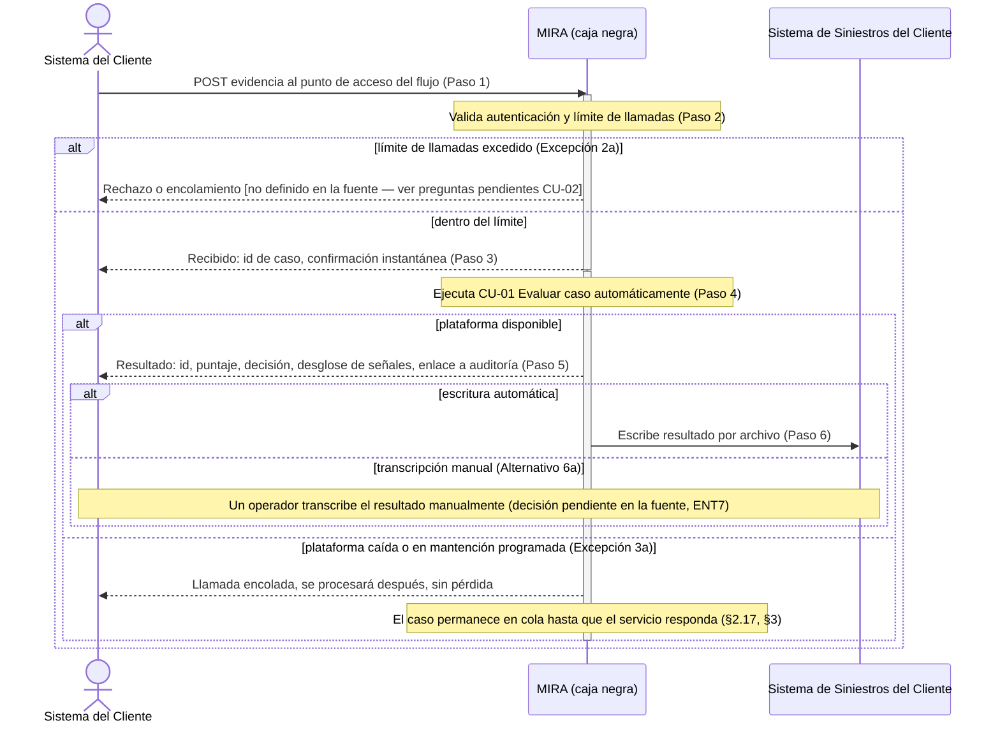

# Fase 8 — Diagrama de secuencia de sistema (§5.3.7)

**Caso de uso elegido:** CU-02 — Integrar caso vía interfaz de programación (`fase4/Fase 4 — Casos de uso (§5.3.2).md`).

**Por qué este y no otro:** de los 3 casos de uso críticos, CU-02 es el único cuyos dos hallazgos sin resolver (H-10, H-11) son exactamente sobre el contrato de interacción actor↔sistema — que es lo que un SSD existe para fijar (límite de llamadas real, y si la arquitectura es síncrona-web o asíncrona-por-archivo). Especificar el SSD de este caso obliga a decidir explícitamente esas dos preguntas o a dejarlas marcadas sin resolver en el propio diagrama, en vez de que queden escondidas en una tabla de texto.

---

## Diagrama (Mermaid)

Sistema MIRA tratado como caja negra: no se descomponen sus componentes internos, solo los eventos que cruzan la frontera hacia el Sistema del Cliente y hacia el Sistema de Siniestros del Cliente.

---

## Checklist de consistencia SSD ↔ CU-02

| Mensaje del SSD | Paso de CU-02 que representa | ¿Coincide? |
|---|---|---|
| `SC->>MIRA`: POST evidencia | Paso 1 | ✅ |
| Nota: valida autenticación y límite | Paso 2 | ✅ |
| Rama "límite excedido" | Excepción 2a | ✅ (marcada como no definida en la fuente, igual que en CU-02) |
| `MIRA-->>SC`: recibido / confirmación | Paso 3 | ✅ |
| Nota: ejecuta CU-01 | Paso 4 | ✅ (CU-02 "incluye" CU-01, no se redibuja su interior aquí) |
| `MIRA-->>SC`: resultado con id/puntaje/decisión/desglose/auditoría | Paso 5 | ✅ |
| `MIRA->>SS`: escribe por archivo | Paso 6 | ✅ |
| Rama "transcripción manual" | Alternativo 6a | ✅ |
| Rama "plataforma caída, encolamiento" | Excepción 3a | ✅ |

No hay ningún mensaje en el SSD sin paso correspondiente en CU-02, ni ningún paso de CU-02 sin representación en el SSD — 👤 verificación de consistencia cerrada (punto explícito de la Fase 8 del plan de trabajo).

**Nota abierta:** igual que en la especificación de CU-02, el comportamiento exacto al superar el límite de llamadas (rechazo vs. encolamiento) queda representado como una rama sin resolver en el diagrama — no se decidió arbitrariamente para que el SSD "se viera completo". Es la misma pregunta pendiente para el representante del cliente, ahora visible también en el diagrama.
