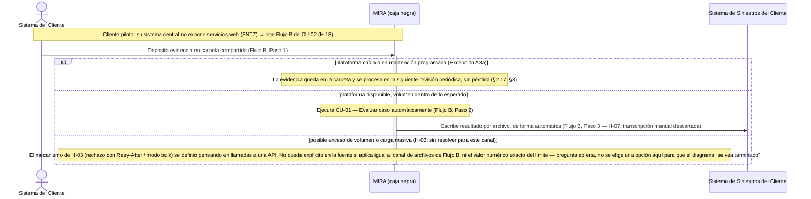

# Fase 8 — Diagrama de secuencia de sistema (§5.3.7)

**Caso de uso elegido:** CU-02 — Integrar caso vía interfaz de programación (`fase4/Fase 4 — Casos de uso (§5.3.2).md`).

**Por qué este y no otro:** de los 3 casos de uso críticos, CU-02 es el que fija el contrato de interacción actor↔sistema con el cliente piloto — que es exactamente lo que un SSD existe para mostrar. Al momento de elegirlo, tenía dos preguntas abiertas: la arquitectura de integración (síncrona-web vs. asíncrona-por-archivo) y el comportamiento ante exceso del límite de llamadas. Ambas se resolvieron en el informe (§5.1) mientras se preparaba este diagrama.

**Actualización de estado (revisión de correspondencia posterior a la primera versión de este diagrama):**
- **H-13 (informe §5.1) — resuelto:** la plataforma soporta ambos patrones de integración; para el cliente piloto, cuyo sistema central no expone servicios web (ENT7), rige el **Flujo B** de CU-02 (intercambio de archivos). Este diagrama representa ese flujo de punta a punta.
- **H-07 (informe §5.1) — resuelto:** la escritura del resultado en el sistema de siniestros del cliente es siempre automática — se descarta la transcripción manual (antes Alternativo B3a, abierto).
- **H-03 (informe §5.1) — resuelto en su mecanismo, no en su valor:** ante exceso del límite, la plataforma rechaza con cabecera `Retry-After` para tráfico estándar, y existe un modo de carga por lote (bulk) con límite propio para cargas masivas predecibles (histórico inicial, catch-up tras caídas). **Sigue sin definirse el valor numérico exacto de ambos límites**, y la fuente no aclara si ese mecanismo —pensado para llamadas a una API— aplica igual al canal de archivos del Flujo B, que no tiene una respuesta síncrona por diseño. Se deja marcado en el diagrama como pregunta abierta, no como rama resuelta.

**Nota sobre la versión anterior de este diagrama:** la primera versión mezclaba el arranque del Flujo A (POST síncrono) con el desenlace del Flujo B (escritura por archivo) como si fuera un "Paso 6" del Flujo A — paso que no existe en CU-02 (Flujo A tiene 5 pasos, Flujo B tiene 3). El checklist de esa versión no detectó la mezcla y aprobó ese mensaje citando un paso inexistente. Se corrige aquí representando el Flujo B completo, que es además el que corresponde una vez resuelto H-13.

---

## Diagrama (Mermaid)

Sistema MIRA tratado como caja negra: no se descomponen sus componentes internos, solo los eventos que cruzan la frontera hacia el Sistema del Cliente y hacia el Sistema de Siniestros del Cliente. Diagrama del **Flujo B** de CU-02 — el que rige para el cliente piloto tras H-13.

---

## Checklist de consistencia SSD ↔ CU-02 (Flujo B)

| Mensaje del SSD | Paso de CU-02 que representa | ¿Coincide? |
|---|---|---|
| `SC->>MIRA`: deposita evidencia en carpeta compartida | Flujo B, paso 1 | ✅ |
| Rama "plataforma caída" | Excepción A3a | ✅ |
| Nota: ejecuta CU-01 | Flujo B, paso 2 | ✅ (CU-02 "incluye" CU-01; no se redibuja su interior aquí) |
| `MIRA->>SS`: escribe por archivo, automático | Flujo B, paso 3 | ✅ (H-07 descarta la transcripción manual) |
| Rama "posible exceso de volumen o carga masiva" | H-03 (mecanismo resuelto para llamadas API; aplicabilidad al canal de archivos y valor numérico, abiertos) | ⚠️ representada como rama explícitamente sin resolver, con el mismo peso visual que las ramas ya decididas — no como una nota al margen |

No hay ningún mensaje del SSD sin paso correspondiente en el Flujo B de CU-02. El Flujo A queda fuera del diagrama porque, tras H-13, no es el que rige para el cliente piloto — no porque se haya omitido por descuido.

**Nota abierta real:** a diferencia de la versión anterior de este diagrama, ya no queda pendiente la arquitectura (H-13), ni la transcripción manual (H-07), ni el mecanismo ante exceso de límite (H-03). Lo único que sigue abierto es (a) el valor numérico exacto de los límites (100/min, 1.000/min, y el del modo bulk) y (b) si el mecanismo de rechazo pensado para una API aplica de igual forma al canal de archivos del Flujo B, que no tiene respuesta síncrona. Ambas quedan para el representante del cliente — no se resuelven aquí por conveniencia.
